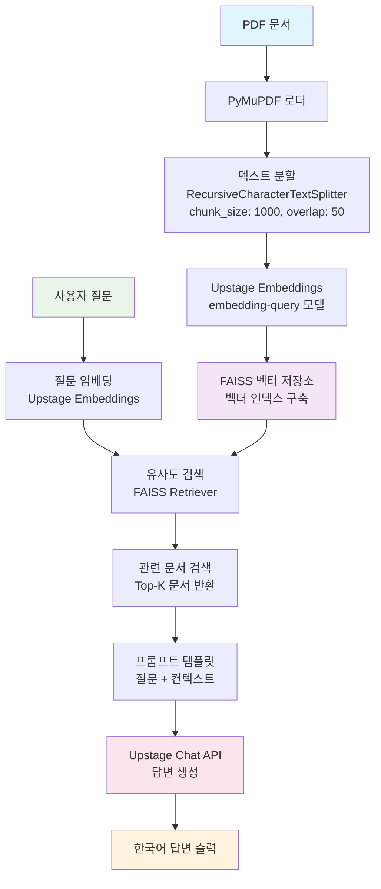

# LangChain을 활용한 RAG 시스템

<br>

## 💻 프로젝트 소개
### <프로젝트 소개>
- LangChain 프로젝트로, RAG(Retrieval-Augmented Generation) 시스템을 구현합니다.
- PDF 문서를 활용하여 질문-답변 시스템을 구축하는 프로젝트입니다.

### <작품 소개>
- LangChain, Upstage API, FAISS를 활용한 문서 기반 질의응답 시스템
- PDF 문서 로드, 텍스트 분할, 임베딩 생성, 벡터 저장소 구축, 검색 및 답변 생성 파이프라인 구현

<br>

<br>

QA Engine 한눈에 보기 (개념 & 목표)
개념

QA Engine은 문서 기반 질의응답 시스템입니다.

사용자가 질문하면, 사전에 구축해 둔 **Knowledge Base(KB)**에서 관련 조각을 **검색(Retrieval)**하고, 그 근거를 바탕으로 LLM이 **답변(Generation)**을 생성합니다.

이 전체 과정을 RAG (Retrieval-Augmented Generation) 파이프라인으로 구현합니다.

이번 프로젝트에서 구축/구현할 핵심 목표

문서 수집/로더: PDF 등에서 텍스트 추출

전처리/청크 분할: 다양한 chunking 전략 실험 가능하게 설계

임베딩 & 벡터 스토어: Upstage Embeddings + FAISS 인덱스 구축/로드

리트리버: Top-K 검색 (+추후 BM25/리랭커 확장 고려)

프롬프트 구성 & 생성: 컨텍스트 주입, 인용/출처 표시, “모르면 모른다고” 가드

평가/로그: LangSmith를 활용한 프롬프트/청크/리트리버 실험 A/B, 최소 스모크 테스트

엔드투엔드 실행: 인덱싱 → 질의 → 답변까지 한 번에 실행

<br>


## 👨‍👩‍👦‍👦 팀 구성원

|  |  |  |  |  |
| :--------------------------------------------------------------: | :--------------------------------------------------------------: | :--------------------------------------------------------------: | :--------------------------------------------------------------: | :--------------------------------------------------------------: |
|            [류지헌](https://github.com/mahomi)             |            [김태현](https://github.com/huefilm)             |            [박진섭](https://github.com/seob1504)             |            [문진숙](https://github.com/June3723)             |            [김재덕](https://github.com/ttcoaster)             |
|                   팀장, RAG 아키텍처 설계<br/>LangChain 파이프라인 구현                   |                   문서 전처리 및 분할<br/>PDF 로더 최적화                   |                   임베딩 및 벡터 저장소<br/>FAISS 성능 튜닝                   |                   프롬프트 엔지니어링<br/>답변 품질 개선                   |                   API 통합 및 배포<br/>환경 설정 관리                   |

<br>

## 🔨 개발 환경 및 기술 스택
- 주 언어 : Python 3.10+
- 패키지 관리 : UV (Ultra-fast Python package manager)
- 주요 라이브러리 :
  - LangChain (Community, Core, OpenAI, Upstage, Text Splitters)
  - FAISS (벡터 검색)
  - PyMuPDF (PDF 처리)
  - python-dotenv (환경변수 관리)
- 버전 및 이슈관리 : GitHub
- 협업 툴 : GitHub, Slack

<br>

## Upstage API Key 발급
1. [Upstage AI Console](https://console.upstage.ai/docs/getting-started)에 접속합니다.
2. 상단 **Dashboard** 를 클릭
3. 좌측 메뉴에서 **API Key**를 선택합니다.
4. **API Key 발급** 버튼을 클릭하여 키를 생성합니다.
5. 발급된 API Key를 복사하여  `.env` 파일에 추가합니다. (env_template파일을 참고) (`UPSTAGE_API_KEY=발급받은_API_키`)

## ⚙️ UV 명령어 사용법
### UV 설치
```bash
pip install uv
```

### 주요 명령어
```bash
# .py 파일 실행
uv run code/baseline.py

# .py 실행없이 의존성 패키지만 설치
uv sync

# 새 패키지 추가
uv add 패키지명
```

<br>

## 📁 프로젝트 구조
```
├── code/
│   ├── baseline.py           # RAG 시스템 기본 구현
│   ├── baseline.ipynb        # RAG 시스템 노트북 버전
│   └── env_template          # 환경 변수 템플릿
├── data/
│   ├── 4.단팥빵(비상스트레이트법).pdf
│   └── SPRI_AI_Brief_2023년12월호_F.pdf
├── pyproject.toml            # 프로젝트 의존성 관리 (UV)
├── uv.lock                   # 의존성 버전 락 파일 (UV)
├── CLAUDE.md                 # 프로젝트 지침
└── README.md
```

<br>

## 💻​ 구현 기능
### 1. 문서 로드 및 전처리
- PDF 문서 로드 (PyMuPDF 활용)
- 텍스트 분할 (RecursiveCharacterTextSplitter)
- 청크 크기 1000, 오버랩 50으로 최적화

### 2. 임베딩 및 벡터 저장소
- Upstage Embeddings API를 활용한 임베딩 생성
- FAISS 벡터 저장소 구축 및 검색
- 의미적 유사성 기반 문서 검색

### 3. RAG 기반 질의응답
- 검색된 문서 컨텍스트를 활용한 답변 생성
- Upstage ChatGPT API 통합
- 한국어 질의응답 지원
- 모르는 내용에 대한 적절한 응답 처리

<br>

## 🛠️ RAG 시스템 아키텍처



### 주요 처리 단계
1. **문서 전처리**: PDF → 텍스트 추출 → 청크 분할
2. **벡터화**: 텍스트 청크 → 임베딩 벡터 → FAISS 인덱스
3. **검색**: 질문 임베딩 → 유사도 검색 → 관련 문서 추출  
4. **생성**: 질문 + 컨텍스트 → LLM → 최종 답변

<br>

## 🚨​ 트러블 슈팅
### 1. OOO 에러 발견

#### 설명
- _프로젝트 진행 중 발생한 트러블에 대해 작성해주세요_

#### 해결
- _프로젝트 진행 중 발생한 트러블 해결방법 대해 작성해주세요_

<br>

## 📌 프로젝트 회고
### 박패캠
- _프로젝트 회고를 작성해주세요_

<br>

## 📰​ 참고자료
- _참고자료를 첨부해주세요_
