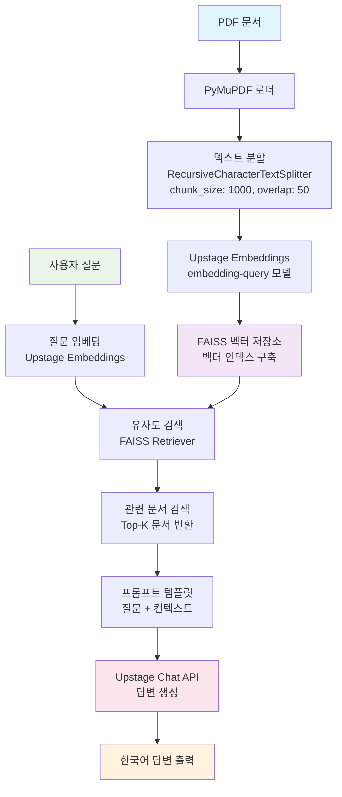

# LangChain을 활용한 RAG 시스템

<br>

## 💻 프로젝트 소개
### <프로젝트 소개>
- LangChain 프로젝트로, RAG(Retrieval-Augmented Generation) 시스템을 구현합니다.
- PDF 문서를 활용하여 질문-답변 시스템을 구축하는 프로젝트입니다.

### <작품 소개>
- LangChain, Upstage API, FAISS를 활용한 문서 기반 질의응답 시스템
- PDF 문서 로드, 텍스트 분할, 임베딩 생성, 벡터 저장소 구축, 검색 및 답변 생성 파이프라인 구현

<br>

## 👨‍👩‍👦‍👦 팀 구성원

|  |  |  |  |  |
| :--------------------------------------------------------------: | :--------------------------------------------------------------: | :--------------------------------------------------------------: | :--------------------------------------------------------------: | :--------------------------------------------------------------: |
|            [류지헌](https://github.com/mahomi)             |            [김태현](https://github.com/huefilm)             |            [박진섭](https://github.com/seob1504)             |            [문진숙](https://github.com/June3723)             |            [김재덕](https://github.com/ttcoaster)             |
|                   팀장, RAG 아키텍처 설계<br/>LangChain 파이프라인 구현                   |                   문서 전처리 및 분할<br/>PDF 로더 최적화                   |                   임베딩 및 벡터 저장소<br/>FAISS 성능 튜닝                   |                   프롬프트 엔지니어링<br/>답변 품질 개선                   |                   API 통합 및 배포<br/>환경 설정 관리                   |

<br>

## 🔨 개발 환경 및 기술 스택
- **주 언어**: Python 3.10+
- **패키지 관리**: UV (Ultra-fast Python package manager)
- **프론트엔드**: Streamlit (WebUI)
- **주요 라이브러리**:
  - **LangChain**: Community, Core, OpenAI, Upstage, Text Splitters
  - **FAISS**: 벡터 검색 및 저장
  - **PyMuPDF**: PDF 문서 처리  
  - **RAGAS**: RAG 시스템 품질 평가
  - **pytest**: 단위/통합 테스트
  - **SQLite**: 대화 데이터 저장
  - **python-dotenv**: 환경변수 관리
- **API**: Upstage AI (Chat, Embeddings)
- **버전 및 이슈관리**: GitHub
- **협업 툴**: GitHub, Slack

<br>

## Upstage API Key 발급
1. [Upstage AI Console](https://console.upstage.ai/docs/getting-started)에 접속합니다.
2. 상단 **Dashboard** 를 클릭
3. 좌측 메뉴에서 **API Key**를 선택합니다.
4. **API Key 발급** 버튼을 클릭하여 키를 생성합니다.
5. 발급된 API Key를 복사하여  `.env` 파일에 추가합니다. (env_template파일을 참고) (`UPSTAGE_API_KEY=발급받은_API_키`)

## ⚙️ UV 명령어 사용법
### UV 설치
```bash
pip install uv
```

### 주요 명령어
```bash
# 기본 RAG 시스템 실행
uv run python code/baseline/baseline.py

# Streamlit WebUI 실행
uv run streamlit run code/main.py

# RAG 품질 평가 실행
uv run python code/evaluate.py

# 테스트 실행
uv run pytest code/tests/

# 의존성 패키지 설치
uv sync

# 새 패키지 추가
uv add 패키지명
```

<br>

## 📁 프로젝트 구조
```
├── code/
│   ├── baseline/             # 기본 RAG 구현
│   │   ├── baseline.py       # 단일 파일 RAG 시스템
│   │   ├── baseline_directoryloader.py  # 다중 파일 처리
│   │   └── baseline_memory.py    # 메모리 기능 포함 버전
│   ├── modules/              # 모듈화된 RAG 컴포넌트
│   │   ├── __init__.py
│   │   ├── sql.py            # SQLite 대화 저장 관리
│   │   ├── logger.py         # 로깅 시스템
│   │   ├── vector_store.py   # 벡터스토어 관리 (통합됨)
│   │   ├── llm.py           # LLM 관리
│   │   ├── retriever.py     # 문서 검색 관리
│   │   ├── chat_history.py  # 채팅 히스토리 관리
│   │   └── crawler.py       # 문서 로딩 관리
│   ├── tests/               # pytest 테스트 코드
│   ├── utils/               # 유틸리티 함수
│   ├── main.py              # Streamlit WebUI
│   └── evaluate.py          # RAGAS 품질 평가 도구
├── data/
│   ├── pdf/                 # PDF 문서들
│   ├── vectorstore/         # FAISS 벡터스토어
│   ├── eval/                # 평가 관련 데이터
│   │   ├── question_dataset.json      # 평가용 질문-답변 데이터셋
│   │   └── evaluation_results/        # 평가 결과 저장
└── README.md
```

<br>

## 💻​ 구현 기능

### 1. 기본 RAG 시스템 (baseline/)
- **baseline.py**: 단일 파일 RAG 시스템 구현
- **baseline_directoryloader.py**: 다중 PDF 파일 처리
- **baseline_memory.py**: 대화 메모리 기능 포함

### 2. 모듈화된 RAG 시스템 (modules/)
- **VectorStoreManager**: FAISS 벡터스토어 관리, 증분 업데이트, 파일 변경 감지
- **LLMManager**: Upstage Chat API 통합, 프롬프트 관리
- **RetrieverManager**: 문서 검색, 유사도 기반 검색
- **ChatHistoryManager**: 대화 기록 관리, 메모리 기능
- **SQLManager**: SQLite 기반 대화 저장
- **LoggerManager**: 통합 로깅 시스템

### 3. Streamlit WebUI (main.py)
- 실시간 채팅 인터페이스
- 대화 히스토리 관리
- 문서 소스 표시
- 설정 패널

### 4. 품질 평가 시스템 (evaluate.py)
- **RAGAS 메트릭**: faithfulness, answer_relevancy, context_recall, answer_correctness
- **데이터셋 기반 평가**: 사전 정의된 질문-답변 쌍 사용
- **결과 저장**: JSON 형태로 평가 결과 저장
- **Upstage API 호환**: baseline.py 방식으로 RAGAS 연동

### 5. 테스트 시스템 (tests/)
- **pytest 기반**: 모든 주요 컴포넌트 테스트
- **단위 테스트**: 각 모듈별 기능 검증
- **통합 테스트**: 전체 파이프라인 검증

<br>

## 🛠️ RAG 시스템 아키텍처



### 주요 처리 단계
1. **문서 전처리**: PDF → 텍스트 추출 → 청크 분할
2. **벡터화**: 텍스트 청크 → 임베딩 벡터 → FAISS 인덱스
3. **검색**: 질문 임베딩 → 유사도 검색 → 관련 문서 추출  
4. **생성**: 질문 + 컨텍스트 → LLM → 최종 답변

<br>

## 🚨​ 트러블 슈팅
### 1. OOO 에러 발견

#### 설명
- _프로젝트 진행 중 발생한 트러블에 대해 작성해주세요_

#### 해결
- _프로젝트 진행 중 발생한 트러블 해결방법 대해 작성해주세요_

<br>

## 📌 프로젝트 회고
### 박패캠
- _프로젝트 회고를 작성해주세요_

<br>

## 📰​ 참고자료
- _참고자료를 첨부해주세요_
